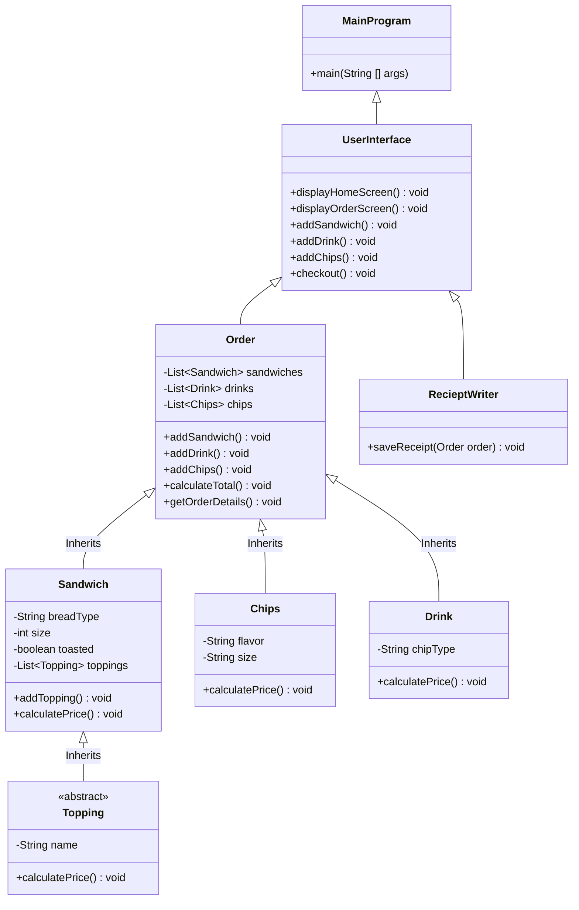

# This is the Kiz Capstone 2 for DELI-cIous!

```mermaid
classDiagram
%% --- Base Class ---
class MainProgram {
+main(String [] args)
}

    %% --- Models Classes ---
    class Order {
        -List~Sandwich~ sandwiches
        -List~Drink~ drinks
        -List~Chips~ chips
        +addSandwich() void
        +addDrink() void
        +addChips() void
        +calculateTotal() void
        +getOrderDetails() void
    }

    class Sandwich {
        -String breadType
        -int size
        -boolean toasted
        -List~Topping~ toppings
        +addTopping() void
        +calculatePrice() void
    }

    class Topping {
        <<abstract>>
        -String name
        +calculatePrice() void
    }

    class Chips {
        -String flavor
        -String size
        +calculatePrice() void
    }

    class Drink {
        -String chipType
        +calculatePrice() void
    }

    %% --- Models Classes ---
    class RecieptWriter {
        +saveReceipt(Order order) void
    }

    %% --- UI Classes ---
    class UserInterface {
        +displayHomeScreen() void
        +displayOrderScreen() void
        +addSandwich() void
        +addDrink() void
        +addChips() void
        +checkout() void
    }

    %% --- Relationships ---
    MainProgram <|-- UserInterface

    UserInterface <|-- RecieptWriter
    UserInterface <| -- Order

    Order <|-- Sandwich  : Inherits
    Order <|-- Chips  : Inherits
    Order <|-- Drink  : Inherits

    Sandwich <|-- Topping  : Inherits
```

